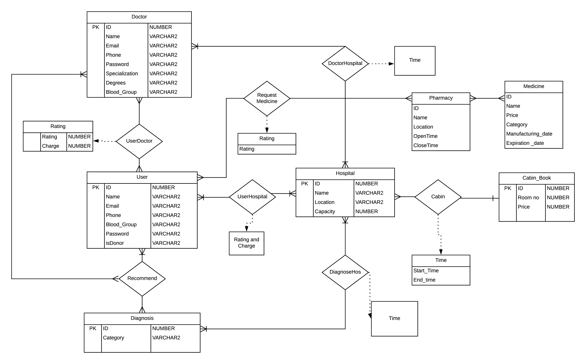

<h1>MediSheba</h1>

<h3>L2 T2 Project of Database System </h3>

<h4>Data Base: Oracle</h4>
<h4>Framework: Django</h4>

Run this project: 
1. Download or clone this repository in your local system 
2. In command prompt or terminal, type and run "pip install -r requirements.txt" 
3. After installing necessary libraries, run "py manage.py runserver" 
4. Your system should have oracle 11g installed  
5. You have to change the Username and Password of Database in the files  

<i> Project still under development </i>

The ERD we are following: 

Group members: 
1. <a href="https://github.com/1705095">Arif Shariar Rahman (1705095)</a>  
2. <a href="https://github.com/MdShamim097">Mohammad Shamim Ahsan (1705097) </a> 
3. <a href="https://github.com/AnikIslamPantha">Anik Islam Pantha (1705104)</a>  
Instructor:  Shehab Sarar Ahmed (SSA) 

